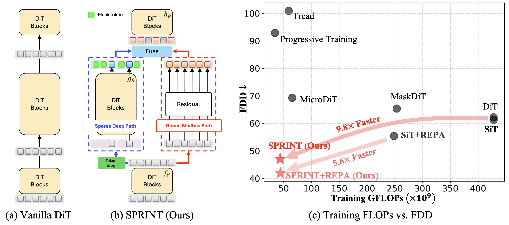

<p align="center">
  <h1 align="middle">Sprint: Sparse-Dense Residual Fusion for Efficient Diffusion Transformers</h1>
  
  <p align="middle">Dogyun Park, Moayed Haji-Ali, Yanyu Li, Willi Menapace, Sergey Tulyakov, Hyunwoo J. Kim, Aliaksandr Siarohin, Anil Kag
  </p>
  <p align="middle">
    <a href="https://arxiv.org/pdf/2510.21986" target='_blank'></a>
  </p>

</p>

---

This repository is an official implementation of "Sprint: Sparse-Dense Residual Fusion for Efficient Diffusion Transformer".

**SUMMARY** We introduce Sparse–Dense Residual Fusion for Efficient Diffusion Transformers
(SPRINT), a simple strategy that enables aggressive token dropping while preserving representation
quality. Notably, on ImageNet-1K 256x256, SPRINT achieves upto ***9.8× training savings*** with comparable or superior FID/FDD.
<div align="center">
  
</div>

Furthermore, during inference, our Path-Drop Guidance (PDG) nearly ***halves inference FLOPs*** while improving quality.
<div align="center">
  
</div>

## ✅ TODO
- [x] Release training code.
- [x] Release inference (sampling) code.
- [-] Release the pre-trained model.

---

## ⚙️ Enviroment
To install requirements, run:
```bash
git clone https://github.com/mlvlab/sprint.git
cd sprint
conda create -n sprint python==3.12.10-
conda activate sprint
pip install torch==2.7.1 torchvision==0.22.1 torchaudio==2.7.1 xformer --index-url https://download.pytorch.org/whl/cu126
pip install requirements.txt
```

---

## Data Preparation
We provide experiments for ImageNet (Download it from [here](https://www.kaggle.com/competitions/imagenet-object-localization-challenge/data)). We follow the preprocessing guide from [here](https://github.com/sihyun-yu/REPA/tree/main/preprocessing).

---

## 🔥 Training
You can update the training config in `config/train`. In order to activate DINOv2 alignment loss (e.g., REPA), replace `representation_align` to `true` and `enc_type` to `dinov2-vit-b`. The intermediate checkpoints and configs will be saved in `exps` folder by default.
### Step1. Pre-training SPRINT with 75% token-dropping.
```bash
accelerate launch --multi_gpu --num_processes=8 train.py --config config/train/SIT_XL_SPRINT_256.yaml
```

### Step2. Finetune SPRINT with full token for very short iterations.
```bash
accelerate launch --multi_gpu --num_processes=8 train.py --config config/train/SIT_XL_SPRINT_256_ft.yaml
```

## Checkpoints on ImageNet 256 & 512
| Model | Res. | Training TFLOPs | FDD (PDG) | FID (PDG) | FDD (CFG) | FID (CFG) |
|:-----|:-----:|:---:|:--:|:---------------:| :---------------:| :---------------:|
| SiT-XL/2 + SPRINT       | 256 | 65.1 | 58.4 | 1.62 | 75.4 | 1.96 |
| SiT-XL/2 + SPRINT + REPA   | 256 | 66.7 | 54.7 | 1.59 | 75.6 | 1.87 |
| SiT-XL/2 + SPRINT  | 512 | 184.8 | 46.9 | 2.55 | 53.6 | 2.23 |

## Inference
You can update the inference config in `config/eval`. Make sure to replace the `ckpt_path`field with your trained model or the provided checkpoint. The generated results will be automatically saved to the `samples` folder by default.
```bash
accelerate launch --multi_gpu --num_processes=8 sample_ddp.py --config config/eval/SiT_XL_SPRINT_PDG.yaml
```
You can also enable our **Path Drop Guidance** by setting `path_drop_guidance: true` in config file and adjust the guidance scale as desired. It generates samples nearly 2x faster than vanilla CFG sampling but with higher quality!

## Acknowledgements
This repo is built upon [SiT](https://github.com/willisma/SiT) and [REPA](https://github.com/sihyun-yu/REPA/tree/main/preprocessing).

## Contact
If you have any questions, please create an issue on this repository or contact at gg933@korea.ac.kr.

## Citation
If you find our work interesting, please consider giving a ⭐ and citation.
```bibtex
@article{park2025sprint,
  title={Sprint: Sparse-Dense Residual Fusion for Efficient Diffusion Transformers},
  author={Park, Dogyun and Haji-Ali, Moayed and Li, Yanyu and Menapace, Willi and Tulyakov, Sergey and Kim, Hyunwoo J and Siarohin, Aliaksandr and Kag, Anil},
  journal={arXiv preprint arXiv:2510.21986},
  year={2025}
}
```
